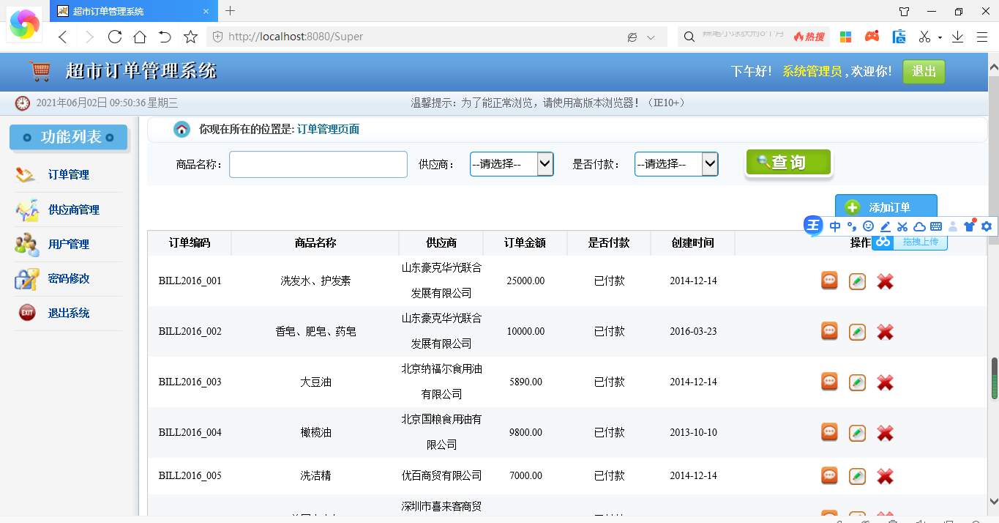
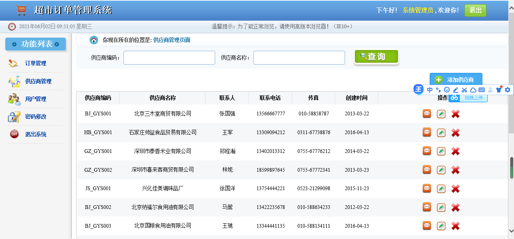
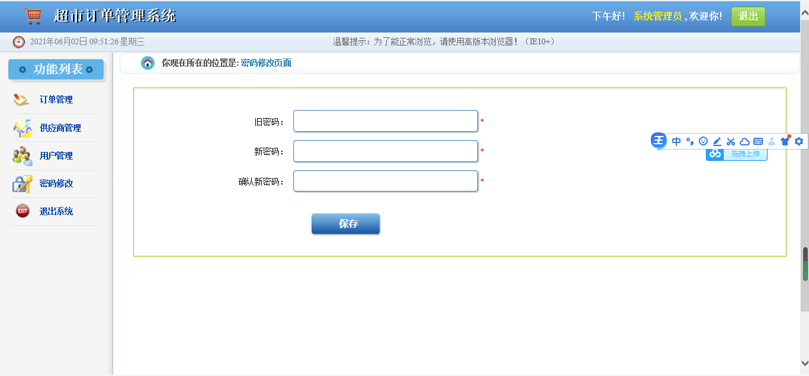
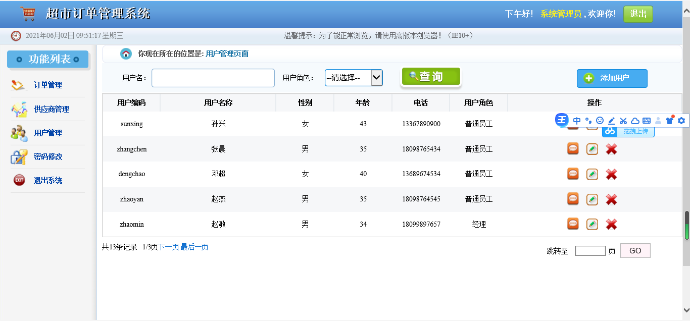

## 基于JSP+Servlet实现的超市订单管理系统

- <b>完整代码获取地址：从戎源码网 ([https://armycodes.com/](https://armycodes.com/))</b>
- <b>技术探讨、资料分享，请加QQ群：692619798</b> 
- <b>作者微信：19941326836  QQ：952045282</b> 
- <b>承接计算机毕业设计、Java毕业设计、Python毕业设计、深度学习、机器学习</b>
- <b>选题+开题报告+任务书+程序定制+安装调试+论文+答辩ppt 一条龙服务</b>
- <b>所有选题地址 ([https://github.com/YuLin-Coder/AllProjectCatalog](https://github.com/YuLin-Coder/AllProjectCatalog)) </b>

## 项目介绍
基于JSP+Servlet实现的超市订单管理系统，主要功能如下

【用户模块】
用户登录、用户管理	对用户输入的用户名，密码进行验证，验证通过后，该用户可以使用系统中进行相关功能的操作。修改密码。进行用户的增删改查。

【订单模块】	
订单管理	添加订单（显示所有供应商）、通过商品名称、供应商、是否付款进行订单查询，查看订单、修改删除订单。

【供应商模块】	
供应商管理 	添加供应商、通过编码、名称进行供应商查询、修改删除供应商

【用户模块】	
用户管理	拥有权限管理的用户可以设定其他用户对软件的访问权限。

## 项目技术
- 编程语言：Java
- 数据库：MySQL
- 前端技术：JSP、JavaScript、bootstrap、JQuery
- 后端技术：Servlet、JDBC

## 运行环境
- JDK版本：JDK1.8及以上
- 开发工具：IDEA、Ecplise、Myecplise都可以
- 数据库: MySQL5.7及以上

## 运行截图

